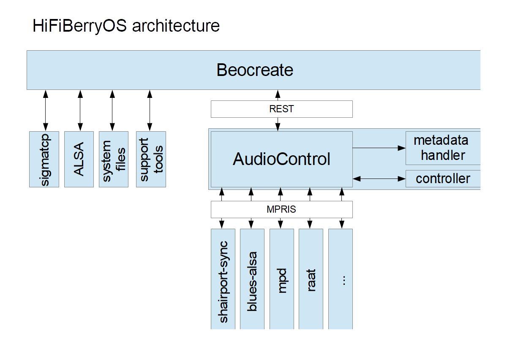

# Architecture

The modular architecture of HiFiBerryOS allows to extend it easily.

## Adding a new services

Adding a services requires two steps:

1. Add the player application. This is the parts that handles music playback. It doesn't need to have have a user interface. 
   Most players don't have one.
   Control of the player and metadata reporting needs to use [MPRIS](https://specifications.freedesktop.org/mpris-spec/2.2/)
2. Add the player module to the GUI. The simplest GUI would be just a UI that can only enable/disable the service. 
   You might add more options (e.g. configuration parameters that the user should be able to set)
   
   
## Dos and don'ts
 
### Automatic configuration
 
A player service should configure itself automatically. The user should not have to deal with device names, mixer controls or stuff like this. There might be services that might require some configuration (e.g. a server name), but try to keep this as minimal as possible. If a server can be automatically discovered using mDNS or similar mechanisms, you should use these and not provide a configuration for the IP address in the UI.

### Volume control

Volume control should be handled via ALSA. A service should not change the volume if it isn't active. It should also not change it when it starts or shuts down. The ALSA mixer device can vary between different sound cards. Therefore, use the control from /etc/hifiberry.state

### Systemd

All services need to be started by systemd. Use the correct dependencies and use restart, but make sure that a service that immediately crashes doesn't get restarted too fast.

	
~~~~
Restart=always
RestartSec=5
~~~~

   
   
